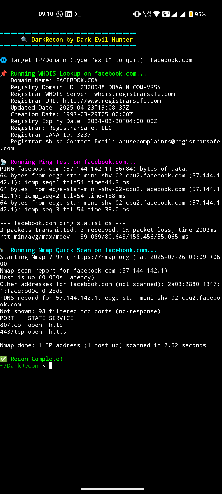

# 🧠 Dark-Evil-Hunter | Terminal-Loving Tech Adventurer 👾

> *"They said 'stay out of the dark web'... I made it my playground."*

Self-taught | Curiosity-fueled | Powered by Termux & strong coffee ☕

---

## 🛠 Tools I Use


---

## 📚 Currently Learning
- 🐍 Python (Scripting & Automation)
- 🧪 Ethical Hacking & Cybersecurity
- 💾 Git, GitHub & Open Source Collaboration
- 🔧 Bash/Shell Commanding

---

## 🎯 Goals for 2025
- [ ] Contribute to open source
- [ ] Build my own CLI tool (DarkRecon 👁️)
- [ ] Automate boring stuff like a boss
- [ ] Get my first freelancing gig 💸
- [ ] Become *Termux Boss* 😎

---

## 📊 GitHub Stats


---

## 🧩 Fun Fact
> I don’t fear 404 errors — I embrace them.  
> Every bug I fix adds XP to my hacker soul 🧛‍♂️


---

## 🔗 Connect With Me
[](mailto:dev.darkevi1hunter@gmail.com)

---

## 🔒 Signature
> *I'm not a developer yet...*  
> *But I'm building the tools that will define me.*

Made with 💀 and 🧠 by [Dark-Evil-Hunter](https://github.com/Dark-Evil-Hunter)

---

# 🔍 DarkRecon

### Simple OSINT-style IP Recon Tool  
*Crafted with passion by [Dark-Evil-Hunter](https://github.com/Dark-Evil-Hunter) 👾*

---

## 🚀 Overview

DarkRecon is a lightweight, easy-to-use bash script designed for quick reconnaissance on any target IP or domain. Perfect for hackers, pentesters, and curious minds who want fast insights without fuss.

---

## ⚙️ Features

- WHOIS lookup for basic domain/IP ownership info  
- Ping test to check live status & latency  
- Quick Nmap scan for open ports & services  

---

## 🔗 Featured Project

👉 [DarkRecon](https://github.com/Dark-Evil-Hunter/DarkRecon) — My first ethical hacking tool, built with Termux & curiosity 💀

---

## 📋 Usage

1. Clone the repo:
   ```bash
   git clone https://github.com/Dark-Evil-Hunter/DarkRecon.git
   cd DarkRecon
## 📸 Demo Screenshot

Here’s a quick look at DarkRecon in action:


